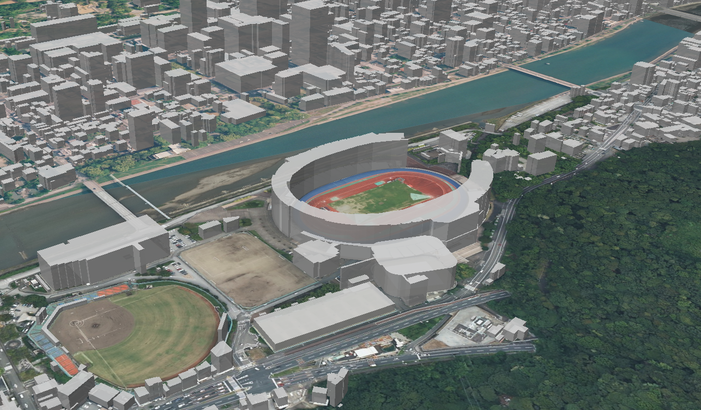

# plateau-kouchi-building-mvt-2023

[3D 都市モデル（Project PLATEAU）高知市（2023 年度）](https://www.geospatial.jp/ckan/dataset/plateau-39201-kouchi-shi-2023)の建築物を地図で表示してます。

[PLATEAU-GIS-Converter](https://github.com/Project-PLATEAU/PLATEAU-GIS-Converter) で CityGML(v4)を MVT に変換して使用してます。

## デモ

https://mikazuki-main.github.io/plateau-kouchi-building-mvt-2023/

## タイル仕様

| URL          | <https://mikazuki-main.github.io/plateau-kouchi-building-mvt-2023/{z}/{x}/{y}.pbf>                                          |
| ------------ | --------------------------------------------------------------------------------------------------------------------------- |
| データソース | [3D 都市モデル（Project PLATEAU）高知市（2023 年度）](https://www.geospatial.jp/ckan/dataset/plateau-39201-kouchi-shi-2023) |
| ズームレベル | 10〜16                                                                                                                      |

## レイヤー定義

| source-layer  | description          |
| ------------- | -------------------- |
| bldg:Building | 建築物の収納レイヤー |

## 地図ライブラリ

オープンソースの[maplibre-gl-js](https://github.com/maplibre/maplibre-gl-js) を使用してます。

## LOD について

出典：[3D 都市モデルの特徴と活用法](https://www.mlit.go.jp/plateau/learning/tpc01-2/#p1_3_2)

### [PLATEAU-GIS-Converter](https://github.com/Project-PLATEAU/PLATEAU-GIS-Converter)

- MVT は最低 LOD のみ対応してるため LOD1 で出力
- [対応フォーマット一覧](https://www.mlit.go.jp/plateau/learning/tpc30/#p30_3)
  
# ライセンス

本データセットは [CC-BY-4.0](LICENSE) で提供されます。
使用の際にはこのレポジトリへのリンクを提示してください。

また、本データセットは [3D 都市モデル（Project PLATEAU）高知市（2023 年度）](https://www.geospatial.jp/ckan/dataset/plateau-39201-kouchi-shi-2023) を
加工して作成したものです。
本データセットの使用・加工にあたっては、[PLATEAU Policy](https://www.mlit.go.jp/plateau/site-policy/) を確認し、権利者の権利を侵害しないように留意してください。
