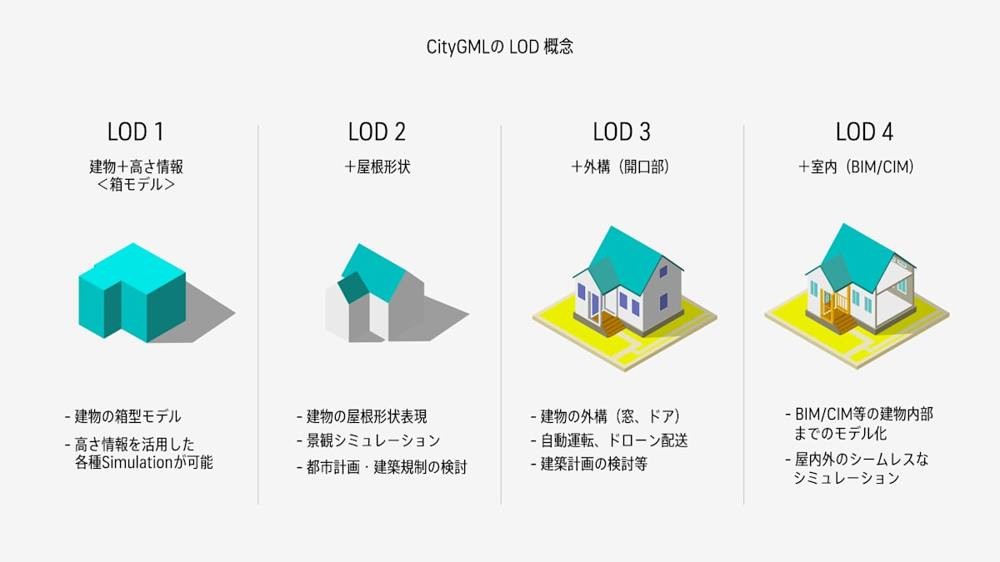

# plateau-kouchi-building-mvt-2023

[3D 都市モデル（Project PLATEAU）高知市（2023 年度）](https://www.geospatial.jp/ckan/dataset/plateau-39201-kouchi-shi-2023)の建築物を地図で表示してます。

CityGML(v4)を MVT に [PLATEAU-GIS-Converter](https://github.com/Project-PLATEAU/PLATEAU-GIS-Converter) を使い変換してます。

## デモ

下記で表示できます ↓↓↓

## 地図ライブラリ

オープンソースの[maplibre-gl-js](https://github.com/maplibre/maplibre-gl-js) を使用

## LOD について

PLATEAU-GIS-Converter

- 上記変換ツールで MVT 出力の設定は最低 LOD（LOD1）を使用
- 最高 LOD で出力可能だが最低 LOD と見た目が同じ（LOD2 表示は別途変換が必要）

出典：[3D 都市モデルの特徴と活用法](https://www.mlit.go.jp/plateau/learning/tpc01-2/#p1_3_2)
